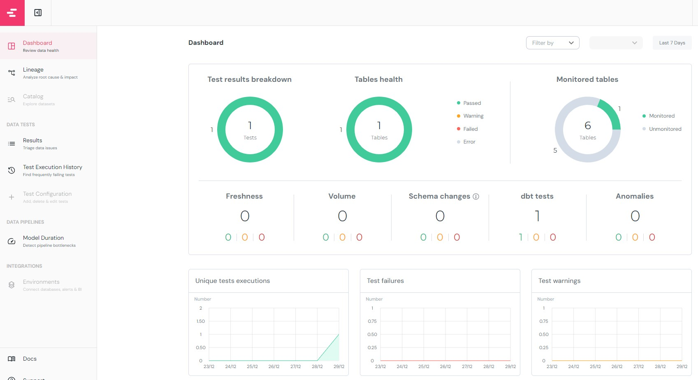

# Check DBT Docs and DBT Elementary Dashboard online which I deployed in the server
- [DBT Docs](https://dbt-snowflake-project.vercel.app)
- [DBT Elementary Dashboard](https://dbt-snowfalkes-project-elementary-report.vercel.app/)


# All Stories to install the project from scratch
## 0-) Prerequisites for this project:
- Have a Snowflake account 
## 1-) Setup Environment with Conda
- Finding the account name may be challenging; the account name should be as follows.

- Go to c:\users\<YOUR_PC_NAME> and create a .dbt folder (Here all your credentials will be stored in a file named profiles.yml)
```
python -m venv venv
source venv/Scripts/activate
pip install --upgrade pip
pip install -r requirements.txt
dbt init
```
- After running "dbt init", select Snowflake for the database, set all variables below.
    - dbt project name: dbt_snowflake
    - account name: Check your email you will get your account name that will end with .snowflakecomputing.com
    - user-id: Put your login user-id
    - password: Put your login password
    - role: ACCOUNTADMIN
    - Warehousename: Put the cluster name (The compute that you are using, by default it will be COMPUTE_WH)
    - database: The database that you using for the project
    - schema: Create a schema (example: dbo.<table_name>)
- If your settings are not set up in default. Create "profiles.yml" like below under .dbt folder and then "dbt debug" to solve your connection.
```
dbt_snowflake:
  target: dev
  outputs:
    dev:
      type: snowflake
      account: vt29564.eu-west-3.aws
      user: xxxxxxxxxx
      password: xxxxxxxxxxx
      database: PREDICTIVE_MAINTENANCE
      warehouse: COMPUTE_WH
      schema: DBT_WITH_SNOWFLAKE
      role: ACCOUNTADMIN
      threads: 10
      client_session_keep_alive: False
```
- After finishing dbt init, you will see the dbt folder "dbt_snowflake", move and check installation with 'dbt debug'.
```
cd dbt_snowflake
dbt debug
```
## 2-) Move Kaggle Dataset into Snowflake
- Download Datasets

- Copy and paste all the Kaggle datasets into that folder.


- To Copy this data into Our Snowflakes
```
dbt seed
```
- Show tables in Snowflake

*NOTE: To access the snowflakes you can install a VS code extension that will help you to connect the Snowflakes instance directly in the editor.*


## 3-) Design the way you want to transform and document the data with DBT
The idea here to to create multiple staging tables using the Kaggle datasets in the dbt seed and then create a combined comprehensive insight table for our final use. We create some models to transform the data under models folder. We have 2 steps to transform the data. The first model is **staging** which is used to read the raw data and to create some views. The second model is **final_tables** which explain the data with comprehensive insights for predictive maintenance.
<p>There are 2 steps in the transformation:</p>
.yml files are a documentation for views and models, .sql files include transformation sql code.

1. Staging views 
2. Final Tables


- if you use "dbt Power User" extension in *vscode*, you can see the transformation diagram (Model Schema) in lineage.


## 4-) Configure the *dbt_project.yml* file for our destination rules and table schemas


## 5-) Run the Transformation to transform data and insert them into final tables
```
dbt run
```


## 6-) Create a DBT docs
- To create a DBT document use the command:
You will see to be created an index.html under target folder.
```
dbt docs generate
```
- To see the document on the web browser: Check adress "**http://localhost:8080**"
```
dbt docs serve
```


## 7-) Publish DBT Docs in a public Server in Vercel.com
Vercel.com is a good platform to publish html files. It has a good integration with github. You can easily import the github repo in Vercel.com


- [DBT Docs](https://dbt-snowflake-project.vercel.app)


## 8-) Create Elementary Dashboard to monitor data quality
- Follow [the elementary documentation](https://docs.elementary-data.com/oss/quickstart/quickstart-cli-package) to installl Elementary dbt packages
- Follow [the elementary documentation](https://docs.elementary-data.com/oss/quickstart/quickstart-cli) to install Elementary CLI
- Run the new model to insert the metrics of Elementry into the snowflake
```
dbt run
```


- Run data quality dashboard with elementary on localhost
```
edr report
```
